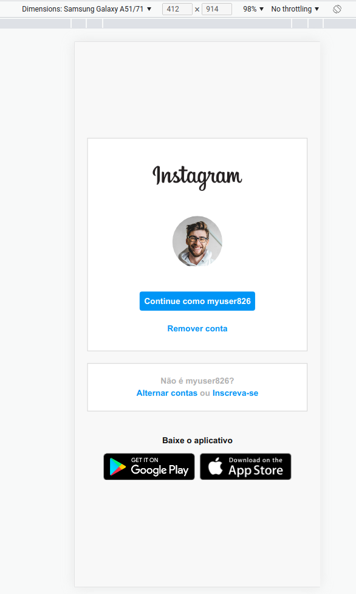

# Clone da página inicial do Instagram
Recriando a página de login do Instagram com objetivo de exercitar o uso do Flexbox (CSS).

## Estrutura e CSS diferentes da aula
Minha página ficou diferente do orientado pelo professor, pois tenho dificuldade de criar todo o conteúdo html para depois posicionar e adicionar estilo com CSS. É mais fácil para mim ir criando a estrutura html, posicionando, e adicionando estilo por partes. Dessa form, consigo solucionar os problemas de layout na medida em que eles forem aparecendo.

## Problema com bordas transparentes
Um dos problemas solucionados foi o de aplicar responsividade e manter alinhamento usando uma imagem com bordas transparentes. Isso fazia a imagem do celular fica desalinhada com as caixas da lateral direita. A solução foi remover a imagem da página e adicionar a mesma como fundo de uma div, cortando as bordas transparentes ao posicionar a imagem ao centro e ao fundo da div. 

## Testes de responsividade
Os testes foram realizados usando as configurações de dispositivos padrões no próprio navegador. O objetivo era verificar se o código elaborado era capaz de apresentar agradávelmente a tela constuída.

